# System Architecture Diagrams

This document contains Mermaid diagrams for the Tax Legal RAG System. Render these diagrams and export as PNG/SVG for use in the Typst report.

## Quick Links to Diagram Files

| Diagram | File | Description |
|---------|------|-------------|
| UML Use Case | [use-case.mmd](diagrams/use-case.mmd) | Actor interactions and system use cases |
| Sequence Diagram | [sequence-diagram.mmd](diagrams/sequence-diagram.mmd) | RAG query flow with detailed interactions |
| C4 Architecture | [architecture-c4.mmd](diagrams/architecture-c4.mmd) | System context and container diagrams |
| System Architecture | [system-architecture.mmd](diagrams/system-architecture.mmd) | Layered architecture overview |
| RAG Pipeline | [rag-pipeline.mmd](diagrams/rag-pipeline.mmd) | Retrieval-Augmented Generation flow |
| Document Processing | [document-processing.mmd](diagrams/document-processing.mmd) | Ingestion pipeline |
| Graph Structure | [graph-structure.mmd](diagrams/graph-structure.mmd) | Knowledge graph node hierarchy |

---

## 1. Overall System Architecture


## 2. RAG Pipeline Flow

```mermaid
flowchart LR
    subgraph Input["📝 Input"]
        Q[User Query]
    end

    subgraph Retrieval["🔍 Retrieval Stage"]
        Embed1[Query Embedding<br/>PhoBERT/MiniLM]
        VecSearch[Vector Search<br/>Cosine Similarity]
        GraphSearch[Graph Traversal<br/>k-hop Neighbors]
    end

    subgraph Ranking["📊 Ranking Stage"]
        Rerank[BGE Reranker<br/>Cross-Encoder]
        TopK[Top-K Selection]
    end

    subgraph Generation["💬 Generation Stage"]
        Context[Context Assembly]
        LLM[Gemini 2.0 Flash]
        Stream[SSE Streaming]
    end

    subgraph Output["📤 Output"]
        Answer[Generated Answer]
        Sources[Source Citations]
    end

    Q --> Embed1
    Embed1 --> VecSearch
    Embed1 --> GraphSearch
    VecSearch --> Rerank
    GraphSearch --> Rerank
    Rerank --> TopK
    TopK --> Context
    Context --> LLM
    LLM --> Stream
    Stream --> Answer
    Stream --> Sources

    classDef input fill:#6366f1,stroke:#4f46e5,color:#fff
    classDef retrieval fill:#14b8a6,stroke:#0d9488,color:#fff
    classDef ranking fill:#f97316,stroke:#ea580c,color:#fff
    classDef generation fill:#a855f7,stroke:#9333ea,color:#fff
    classDef output fill:#22c55e,stroke:#16a34a,color:#fff

    class Q input
    class Embed1,VecSearch,GraphSearch retrieval
    class Rerank,TopK ranking
    class Context,LLM,Stream generation
    class Answer,Sources output
```



## 3. Document Processing Pipeline

```mermaid
flowchart TB
    subgraph Collection["📥 Data Collection"]
        Web[LuatVietnam.vn]
        Crawler[Playwright Crawler]
        HTML[Raw HTML]
    end

    subgraph Parsing["📄 Document Parsing"]
        Parser[Structure Parser]
        Metadata[Metadata Extraction]
        Hierarchy[Hierarchical Split]
    end

    subgraph NLP["🧠 NLP Processing"]
        NER[NER Model<br/>BiLSTM-CRF]
        RE[RE Model<br/>Transformer]
        Embed[Text Embedding<br/>PhoBERT]
    end

    subgraph Graph["🕸️ Graph Construction"]
        DocNode[Document Nodes]
        StructEdge[Structural Edges<br/>HAS_CHAPTER, HAS_CLAUSE]
        RelEdge[Relational Edges<br/>PURSUANT, REFERENCE]
        ChunkNode[Chunk Nodes]
    end

    subgraph Storage["💾 Storage"]
        Neo4j[(Neo4j AuraDB)]
        VecIdx[Vector Index]
    end

    Web --> Crawler
    Crawler --> HTML
    HTML --> Parser
    Parser --> Metadata
    Parser --> Hierarchy

    Metadata --> NER
    Hierarchy --> RE
    Hierarchy --> Embed

    NER --> DocNode
    RE --> RelEdge
    Hierarchy --> StructEdge
    Embed --> ChunkNode

    DocNode --> Neo4j
    StructEdge --> Neo4j
    RelEdge --> Neo4j
    ChunkNode --> VecIdx
    VecIdx --> Neo4j

    classDef collection fill:#0ea5e9,stroke:#0284c7,color:#fff
    classDef parsing fill:#84cc16,stroke:#65a30d,color:#fff
    classDef nlp fill:#f43f5e,stroke:#e11d48,color:#fff
    classDef graph fill:#8b5cf6,stroke:#7c3aed,color:#fff
    classDef storage fill:#64748b,stroke:#475569,color:#fff

    class Web,Crawler,HTML collection
    class Parser,Metadata,Hierarchy parsing
    class NER,RE,Embed nlp
    class DocNode,StructEdge,RelEdge,ChunkNode graph
    class Neo4j,VecIdx storage
```

## 4. Graph Node Structure

```mermaid
flowchart TB
    subgraph DocumentHierarchy["📜 Document Hierarchy"]
        Doc[("Document<br/>Luật 23/2020/QH14")]
        Ch1[("Chapter I<br/>Chương I")]
        Ch2[("Chapter II<br/>Chương II")]
        Cl1[("Clause 1<br/>Điều 1")]
        Cl2[("Clause 2<br/>Điều 2")]
        Pt1[("Point 1<br/>Khoản 1")]
        Pt2[("Point 2<br/>Khoản 2")]
        Sp[("Subpoint a<br/>Điểm a")]
    end

    subgraph Chunks["📦 Chunk Layer"]
        Ck1[("Chunk<br/>Điều 1 + content")]
        Ck2[("Chunk<br/>Điều 2 + content")]
    end

    Doc -->|HAS_CHAPTER| Ch1
    Doc -->|HAS_CHAPTER| Ch2
    Ch1 -->|HAS_CLAUSE| Cl1
    Ch1 -->|HAS_CLAUSE| Cl2
    Cl1 -->|HAS_POINT| Pt1
    Cl1 -->|HAS_POINT| Pt2
    Pt1 -->|HAS_SUBPOINT| Sp

    Cl1 -->|IS_IN| Ck1
    Cl2 -->|IS_IN| Ck2

    subgraph CrossRef["🔗 Cross-References"]
        Doc2[("Document<br/>NĐ 34/2016")]
        Cl3[("Clause 5<br/>Điều 5")]
    end

    Doc -->|PURSUANT| Doc2
    Cl1 -.->|REFERENCE| Cl3

    classDef doc fill:#3b82f6,stroke:#1d4ed8,color:#fff
    classDef chapter fill:#10b981,stroke:#059669,color:#fff
    classDef clause fill:#f59e0b,stroke:#d97706,color:#fff
    classDef point fill:#8b5cf6,stroke:#7c3aed,color:#fff
    classDef chunk fill:#64748b,stroke:#475569,color:#fff
    classDef external fill:#ef4444,stroke:#dc2626,color:#fff

    class Doc doc
    class Ch1,Ch2 chapter
    class Cl1,Cl2 clause
    class Pt1,Pt2,Sp point
    class Ck1,Ck2 chunk
    class Doc2,Cl3 external
```



## Rendering Instructions

To render these diagrams:

1. **Mermaid CLI** (recommended for PNG/SVG):
   ```bash
   npm install -g @mermaid-js/mermaid-cli
   mmdc -i architecture-diagrams.md -o images/ -e png
   ```

2. **Online**: Use https://mermaid.live/ to paste and export

3. **VS Code**: Install "Markdown Preview Mermaid Support" extension

Export each diagram as PNG and save to `images/` folder with names:
- `system-architecture-detailed.png`
- `rag-pipeline-flow.png`
- `document-processing-pipeline.png`
- `graph-node-structure.png`
